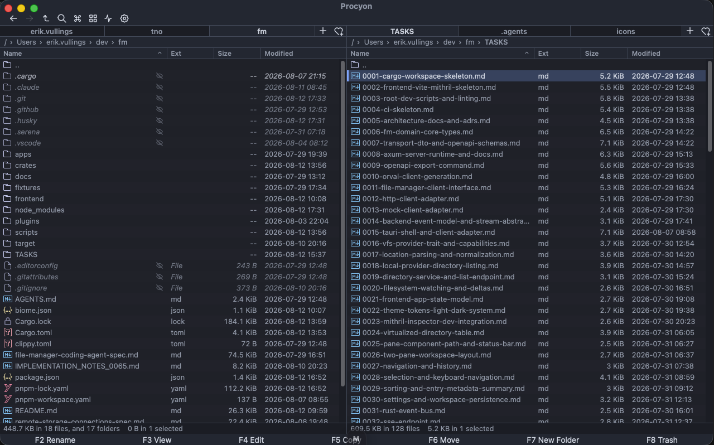
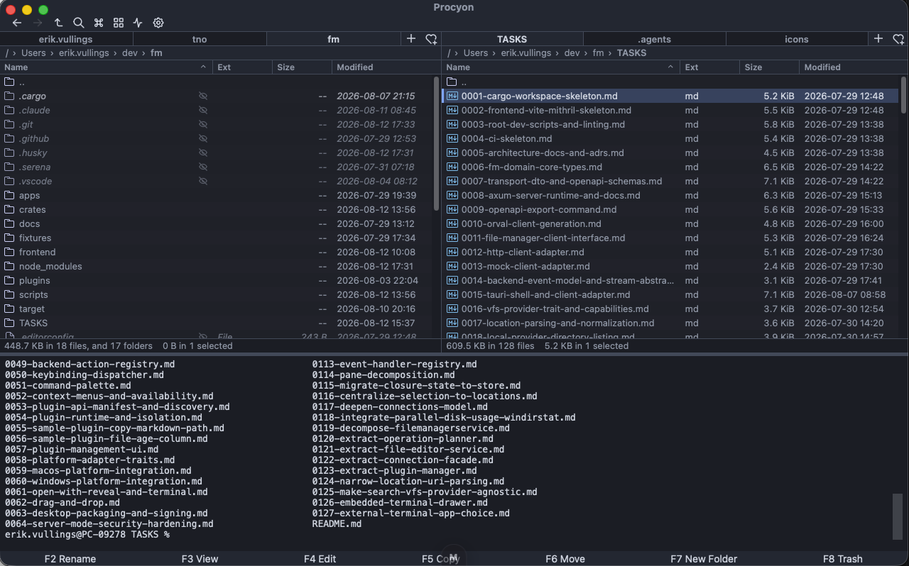
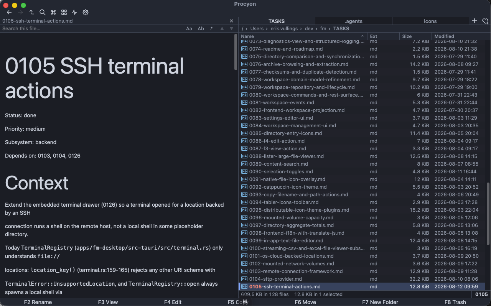
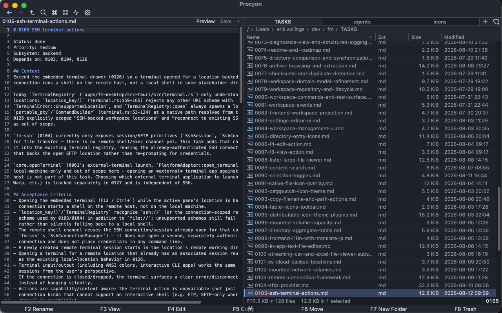

# Procyon

**A fast, keyboard-first dual-pane file manager for local, remote, and cloud storage.**

Procyon combines a Rust operation engine with a shared Mithril interface for the desktop and
browser. Browse large directories, move files between providers, inspect documents, open remote
shells, and automate repetitive work without leaving the file manager.

[](https://github.com/erikvullings/procyon/actions/workflows/ci.yml)
[](LICENSE)
[](https://github.com/erikvullings/procyon/releases/latest)



## Why Procyon

| Capability | Highlights |
| --- | --- |
| **Navigate quickly** | Dual panes, tabs, breadcrumbs, history, favourites, a directory tree, quick filtering, recursive search, and a command palette |
| **Handle large collections** | Virtualized lists tested with one million entries, grid view, thumbnails, folder grouping, sorting, Git status, and disk-usage treemaps |
| **Move data safely** | Cancellable and resumable copy, move, rename, duplicate, trash, archive, and synchronization jobs with explicit conflict handling |
| **Work across providers** | Local files, SFTP, FTP/FTPS, WebDAV, S3-compatible storage, OneDrive, archives, and mounted network volumes |
| **Inspect files in place** | Fast text, image, video, PDF, archive, CSV, JSON, Excel, DOCX, and PPTX previews plus an integrated text editor |
| **Adapt the workflow** | Configurable shortcuts, light and dark themes, native platform actions, and resource-limited Lua plugins |

Procyon never implements file mutations in the frontend. Every operation goes through the same
typed Rust engine, whether the app is running through Tauri, Axum, or the in-process mock client.

## Screenshots

| Embedded terminal | Document preview |
| --- | --- |
| [](site/image-2.png) | [](site/image-3.png) |

### Integrated editor

[](site/image-4.png)

## Quick start

The default development runtime uses built-in mock data, so it does not need a Rust server.

```bash
git clone https://github.com/erikvullings/procyon.git
cd procyon
corepack enable
pnpm install
pnpm dev
```

Open <http://127.0.0.1:5180>.

### Choose a runtime

| Runtime | Command | Backend |
| --- | --- | --- |
| Mock | `pnpm dev` | In-process fixtures; no Rust process required |
| HTTP | `pnpm dev:server` and `pnpm dev:http` in separate terminals | Axum REST API and SSE on port 8787 |
| Desktop | `pnpm dev:tauri` | Tauri commands and event channels |

The HTTP development server disables authentication only on loopback. Production server mode
requires a session token and should be placed behind TLS. See
[Server-mode security](docs/architecture/security.md) for deployment guidance.

## Requirements

| Tool | Version | Purpose |
| --- | --- | --- |
| Rust | **1.97.1** | Pinned by `rust-toolchain.toml` |
| Node.js | **22 LTS** | Frontend and repository scripts |
| pnpm | **12** | Pinned by `packageManager` in `package.json` |
| cargo-watch | Latest | Automatic Axum rebuilds during HTTP development |
| cargo-nextest | Latest | Rust test runner used by CI |

Install the two Cargo tools when you need the HTTP development loop or the Rust test suite:

```bash
cargo install cargo-watch
cargo install cargo-nextest --locked
```

<details>
<summary><strong>Desktop build prerequisites</strong></summary>

### macOS

Install Xcode Command Line Tools:

```bash
xcode-select --install
```

### Windows

Install Microsoft C++ Build Tools for Visual Studio 2022 and the WebView2 Runtime. WebView2 is
included with Windows 11.

### Linux

Install the WebKitGTK 4.1 development libraries and Tauri's system dependencies for your
distribution. The package names commonly include:

```text
webkit2gtk-4.1 build-essential curl wget file libssl-dev
libayatana-appindicator3-dev librsvg2-dev
```

See the [Tauri prerequisites guide](https://tauri.app/start/prerequisites/) for current
distribution-specific commands.

</details>

## Development commands

Run commands from the repository root.

| Command | Purpose |
| --- | --- |
| `pnpm dev` | Start Vite with the mock client |
| `pnpm dev:http` | Start Vite against the Axum backend |
| `pnpm dev:server` | Start the Axum backend with automatic rebuilds |
| `pnpm dev:tauri` | Launch the Tauri desktop app |
| `pnpm test` | Run Rust, frontend, and script tests |
| `pnpm test:rust` | Run the Rust suite and doctests |
| `pnpm test:frontend` | Run Vitest |
| `pnpm lint` | Run Rust and frontend formatting and lint checks |
| `pnpm build` | Build the production Rust and frontend targets |
| `pnpm build:tauri` | Package the desktop application |
| `pnpm api:check` | Verify the OpenAPI document and generated client are current |

### HTTP development

Run the server and frontend in separate terminals:

```bash
# Terminal 1
pnpm dev:server

# Terminal 2
pnpm dev:http
```

Vite proxies `/api/*` to `http://127.0.0.1:8787`, including the unbuffered SSE event stream.
Swagger UI is available at <http://127.0.0.1:8787/api/v1/docs>.

On Windows, the repository commands above work in PowerShell because environment variables are
set through `cross-env`.

## Keyboard essentials

Procyon uses **Cmd** as the primary modifier on macOS and **Ctrl** on Windows and Linux.

| Action | Shortcut |
| --- | --- |
| View / edit | `F3` / `F4` |
| Copy / move | `F5` / `F6` |
| New folder | `F7` |
| Trash | `F8` or `Delete` |
| Rename | `F2` |
| Command palette | `Cmd/Ctrl+P` |
| Focus location | `Cmd/Ctrl+L` |
| Quick filter | `Cmd/Ctrl+F` |
| Find files | `Option/Alt+F7` |
| Toggle directory tree | `Option/Alt+F10` |
| Disk usage | `Cmd/Ctrl+Shift+L` |
| Embedded terminal | `Ctrl+Backtick` or `F12` |
| Shortcut reference | `F1` |

The in-app `F1` reference is the authoritative list. Browser-reserved shortcuts may only be
available in the desktop app. The
[Total Commander parity audit](TASKS/0128-total-commander-shortcuts-quick-wins.md) records design
decisions and intentionally unsupported bindings.

## Architecture

```text
Mithril frontend
    |
    +-- mock client
    +-- generated HTTP client + SSE
    +-- Tauri commands + channels
                |
        FileManagerClient
                |
       fm-application services
                |
    VFS providers + operation engine
```

The frontend depends only on `FileManagerClient`. Axum and Tauri remain thin adapters around the
same application services, while filesystem access stays behind provider-neutral VFS traits.

| Path | Responsibility |
| --- | --- |
| `apps/fm-server` | Axum API and SSE host |
| `apps/fm-desktop` | Tauri desktop shell |
| `crates/fm-application` | Host-facing capability services |
| `crates/fm-operations` | Job scheduling, progress, cancellation, and conflicts |
| `crates/fm-vfs-*` | Local and remote filesystem providers |
| `crates/fm-semantic-*` | Optional semantic worker, conversion, and library services |
| `frontend` | Shared Mithril and TypeScript interface |
| `plugins` | Bundled Lua and icon-theme plugins |
| `docs` | Architecture, security, and design decisions |
| `TASKS` | Detailed implementation contracts and status |

Do not hand-edit generated files under `frontend/src/api`, `frontend/openapi/openapi.json`, or the
Rust protobuf output. Use `pnpm api:export` and `pnpm api:generate` for HTTP artifacts.

## Installation

Download packaged builds from [GitHub Releases](https://github.com/erikvullings/procyon/releases).
macOS and x86_64 Linux users can also install through Homebrew:

```bash
brew tap erikvullings/tap
brew install --cask procyon
```

Homebrew 6.0 and later may require `brew trust erikvullings/tap` before installing from a
third-party tap.

Windows packages are published to Chocolatey after community moderation:

```powershell
choco install procyon
```

macOS releases are signed and notarized. Windows releases are currently unsigned and can trigger a
Microsoft Defender SmartScreen warning. Auto-update is not yet included.

## Project status

Procyon is under active development. Native SMB and external remote-desktop launch remain planned;
provider, platform, and milestone status is tracked in:

- [Roadmap](ROADMAP.md)
- [Task index](TASKS/README.md)
- [Full specification](file-manager-coding-agent-spec.md)

Architecture and operational references:

- [Architecture overview](docs/architecture/overview.md)
- [Architecture decisions](docs/decisions/)
- [Server-mode security](docs/architecture/security.md)
- [Plugin API](docs/plugin-api/README.md)
- [Semantic operations](docs/semantic-operations.md)
- [Semantic threat model](docs/semantic-threat-model.md)

## Contributing

Before changing an area, read its matching file in `TASKS/`; it defines the contract and module
boundaries, not only the implementation history. Keep browser and desktop behavior equivalent,
route mutations through the operation engine, and preserve the VFS abstraction.

Before opening a pull request:

```bash
pnpm lint
pnpm test
```

<details>
<summary><strong>macOS mounted-volume permissions</strong></summary>

If an external drive reports `Unable to show. Denied permissions`, macOS privacy controls may be
blocking removable-volume access even when Finder can open it.

1. Open **System Settings > Privacy & Security > Full Disk Access**.
2. Add **Procyon.app** and enable access.
3. Fully quit Procyon with `Cmd+Q`, then reopen it.

Some macOS versions expose a separate **Removable Volumes** permission in the same settings area.

</details>

## License

See [LICENSE](LICENSE).
