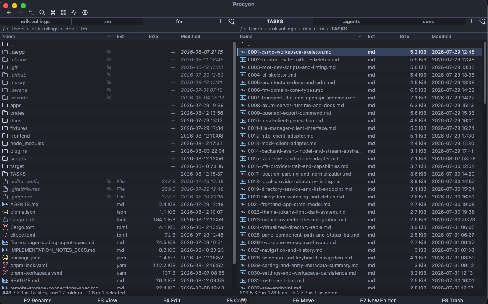
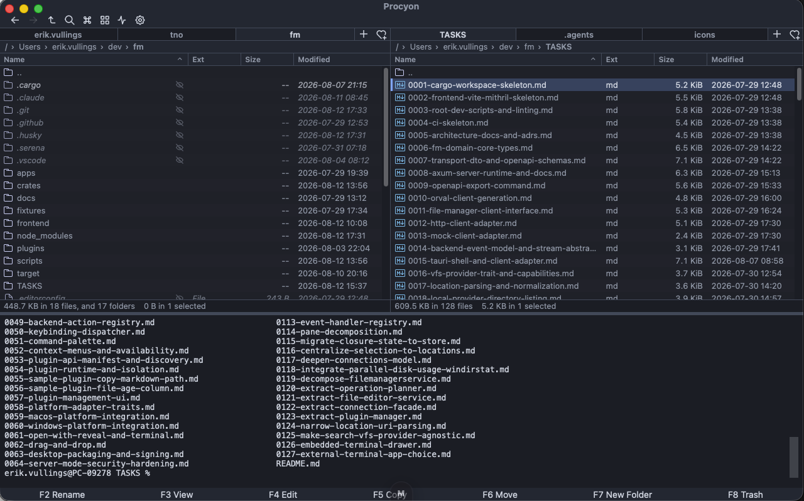
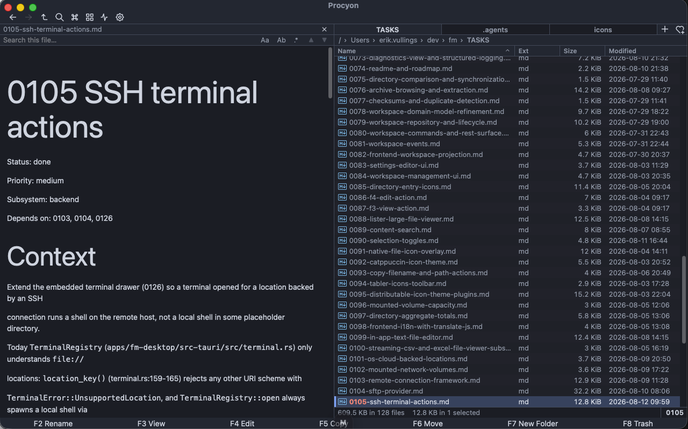
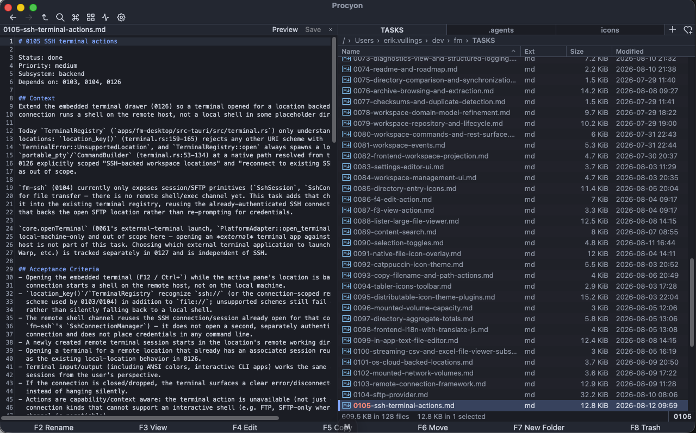

# Procyon

**A fast, keyboard-first dual-pane file manager for local, remote, and cloud storage.**

Procyon combines a Rust operation engine with a shared Mithril interface for the desktop and
browser. Browse large directories, move files between providers, inspect documents, open remote
shells, and automate repetitive work without leaving the file manager.
Its name comes from the raccoon genus: a gatherer of things from many places, much like the
collection basket gathers files across folders and providers.

[](https://github.com/erikvullings/procyon/actions/workflows/ci.yml)
[](LICENSE)
[](https://github.com/erikvullings/procyon/releases/latest)



## Why Procyon

| Capability | Highlights |
| --- | --- |
| **Navigate quickly** | Dual panes, tabs, breadcrumbs, history, favourites, a directory tree, quick filtering, recursive search, and a command palette |
| **Handle large collections** | Virtualized lists tested with one million entries, grid view, thumbnails, folder grouping, sorting, Git status, and disk-usage treemaps |
| **Move data safely** | Cancellable and resumable copy, move, rename, duplicate, trash, archive, and synchronization jobs with explicit conflict handling |
| **Work across providers** | Local files, SFTP, FTP/FTPS, WebDAV, S3-compatible storage, OneDrive, archives, and mounted network volumes |
| **Inspect files in place** | Fast text, image, video, PDF, archive, CSV, JSON, Excel, DOCX, and PPTX previews plus an integrated text editor |
| **Adapt the workflow** | Configurable shortcuts, light and dark themes, native platform actions, and resource-limited Lua and JavaScript plugins |

Procyon never implements file mutations in the frontend. Every operation goes through the same
typed Rust engine, whether the app is running through Tauri, Axum, or the in-process mock client.

## Background work

The badge beside Operations shows active file operations and semantic indexing. Open it for
per-job progress and shortcuts to the Operations Centre or Semantic settings. A total or
percentage appears only when the job knows one; permanent deletion instead reports items
already removed. A folder being moved or deleted remains navigable and shows its current
state until the operation finishes.

Quitting the desktop app while work is active prompts for confirmation. File operations stop
and are shown as interrupted after restart; partial changes, including permanently deleted
items, are **not** rolled back or resumed automatically. Enrolled semantic folders are
reconciled again on desktop startup. Closing a browser tab does not stop work in a separately
running server, but restarting that server interrupts its file operations.

## Screenshots

| Embedded terminal | Document preview |
| --- | --- |
| [](site/image-2.png) | [](site/image-3.png) |

### Integrated editor

[](site/image-4.png)

## Quick start

The default development runtime uses built-in mock data, so it does not need a Rust server.

```bash
git clone https://github.com/erikvullings/procyon.git
cd procyon
corepack enable
pnpm install
pnpm dev
```

Open <http://127.0.0.1:5180>.

### Choose a runtime

| Runtime | Command | Backend |
| --- | --- | --- |
| Mock | `pnpm dev` | In-process fixtures; no Rust process required |
| HTTP | `pnpm dev:server` and `pnpm dev:http` in separate terminals | Axum REST API and SSE on port 8787 |
| Desktop | `pnpm dev:tauri` | Tauri commands and event channels |

The HTTP development server disables authentication only on loopback. Production server mode
requires a session token and should be placed behind TLS. See
[Server-mode security](docs/architecture/security.md) for deployment guidance.

## Requirements

| Tool | Version | Purpose |
| --- | --- | --- |
| Rust | **1.98.1** | Pinned by `rust-toolchain.toml`; includes the macOS 27 Mach-O `LINKEDIT` alignment fix |
| Node.js | **22 LTS** | Frontend and repository scripts |
| pnpm | **12** | Pinned by `packageManager` in `package.json` |
| cargo-watch | Latest | Automatic Axum rebuilds during HTTP development |
| cargo-nextest | Latest | Rust test runner used by CI |

Install the two Cargo tools when you need the HTTP development loop or the Rust test suite:

```bash
cargo install cargo-watch
cargo install cargo-nextest --locked
```

<details>
<summary><strong>Desktop build prerequisites</strong></summary>

### macOS

Install Xcode Command Line Tools:

```bash
xcode-select --install
```

### Windows

Install Microsoft C++ Build Tools for Visual Studio 2022 and the WebView2 Runtime. WebView2 is
included with Windows 11.

### Linux

Install the WebKitGTK 4.1 development libraries and Tauri's system dependencies for your
distribution. The package names commonly include:

```text
webkit2gtk-4.1 build-essential curl wget file libssl-dev
libayatana-appindicator3-dev librsvg2-dev
```

See the [Tauri prerequisites guide](https://tauri.app/start/prerequisites/) for current
distribution-specific commands.

</details>

## Development commands

Run commands from the repository root.

| Command | Purpose |
| --- | --- |
| `pnpm dev` | Start Vite with the mock client |
| `pnpm dev:http` | Start Vite against the Axum backend |
| `pnpm dev:server` | Start the Axum backend with automatic rebuilds |
| `pnpm dev:tauri` | Launch the Tauri desktop app |
| `pnpm dev:tauri:semantic:gemma` | Launch a local desktop with the optional Gemma development catalog |
| `pnpm test` | Run Rust, frontend, and script tests |
| `pnpm test:rust` | Run the Rust suite and doctests |
| `pnpm test:frontend` | Run Vitest |
| `pnpm lint` | Run Rust and frontend formatting and lint checks |
| `pnpm build` | Build the production Rust and frontend targets |
| `pnpm build:tauri` | Package the desktop application |
| `pnpm api:check` | Verify the OpenAPI document and generated client are current |

### Try EmbeddingGemma 2 on your own folder

Run `pnpm dev:tauri:semantic:gemma` from the repository root on macOS arm64
(the locally verified target; other platforms are not yet qualified). The command verifies the
pinned E5 and EmbeddingGemma 2 files, builds an optimized native Gemma worker,
and launches the development desktop with a **development-key-signed**, local
installation catalog. It needs about 1.5 GiB for the Gemma checkpoint plus
space for the catalog and installed copies; the UI discloses an 8 GiB RAM
estimate. The model download may require access to Google's gated Hugging Face
repository. To build the bundle without launching Tauri, run
`pnpm semantic:bundle:dev --gemma`.

In the desktop, open **Settings → Semantic components**, choose **EmbeddingGemma
2 (optional)**, select 128/256/512/768 dimensions and the desired image, audio,
and video checkboxes, acknowledge the fresh index, then select **Accept and install**.
The signed offer loads automatically; individual artifact files are available under
**Technical details** if needed. Installation retains the existing E5 library and
activates the separately initialized Gemma library. Open the folder
you want to compare in a pane; in **Settings → Semantic library**, review its
inclusion and choose **Include and index folder**. Once indexing progresses,
search or Ask within the indexed folder. The selected dimensions and media
permissions cannot be changed for that Gemma library. Existing E5 data is not
deleted; no migration or representative quality result is implied by this
development bundle. Standard release builds remain Gemma-disabled. Included
folders can be removed directly from **Settings → Semantic library**, even when
their sources are unavailable; confirm the displayed cleanup inventory to
remove their local index data without deleting original files. Moving, deleting,
or temporarily disconnecting an included root does not automatically purge its
index, so remove it explicitly if it should no longer appear in search.

To make scanned PDFs searchable, install OCRmyPDF 16.x or 17.x on the desktop,
then open **Settings → Make scanned PDFs searchable** and allow OCRmyPDF.
Procyon runs it only for reported PDFs you explicitly select, without replacing
the original PDF. The development launcher (including
`pnpm dev:tauri:semantic:ocr`) follows this Settings consent; its former
`--ocr` environment opt-in does not override it. If an installed OCRmyPDF is
not found, launch the desktop from a shell where `ocrmypdf` is on `PATH`.

### HTTP development

Run the server and frontend in separate terminals:

```bash
# Terminal 1
pnpm dev:server

# Terminal 2
pnpm dev:http
```

Vite proxies `/api/*` to `http://127.0.0.1:8787`, including the unbuffered SSE event stream.
Swagger UI is available at <http://127.0.0.1:8787/api/v1/docs>.

On Windows, the repository commands above work in PowerShell because environment variables are
set through `cross-env`.

## Keyboard essentials

Procyon uses **Cmd** as the primary modifier on macOS and **Ctrl** on Windows and Linux.

| Action | Shortcut |
| --- | --- |
| View / edit | `F3` / `F4` |
| Copy / move | `F5` / `F6` |
| New folder | `F7` |
| Trash | `F8` or `Delete` |
| Rename | `F2` |
| Command palette | `Cmd/Ctrl+P` |
| Focus location | `Cmd/Ctrl+L` |
| Quick filter | `Cmd/Ctrl+F` |
| Find files | `Option/Alt+F7` |
| Toggle directory tree | `Option/Alt+F10` |
| Disk usage | `Cmd/Ctrl+Shift+L` |
| Embedded terminal | `Ctrl+Backtick` or `F12` |
| Shortcut reference | `F1` |

Disk usage scans the active directory in a transient tab in the other pane. Selecting a
treemap folder opens it in the original pane while zooming the treemap; selecting a file
reveals it in its parent directory there. Closing the treemap tab restores the other pane's
previous tab.

Directory-tree folders can be dragged onto another tree folder, a pane directory, or a tab;
table entries can also be dropped onto tree folders. A valid target is outlined. Drops move by
default; hold Command or Option on macOS, or Control on Windows/Linux, to copy instead. The
ordinary operation confirmation and conflict handling still apply. Use Cut/Copy and Paste for
the keyboard equivalent.

The in-app `F1` reference is the authoritative list. Browser-reserved shortcuts may only be
available in the desktop app. The
[Total Commander parity audit](TASKS/0128-total-commander-shortcuts-quick-wins.md) records design
decisions and intentionally unsupported bindings.

## Collection basket

Select entries in any folder, tab, or provider and use the shopping-basket toolbar button to add
them. Open the basket with the adjacent toolbar button; it appears as a tab in the active pane.
While that tab is visible, **F5** or **Add to basket** collects the selection from the directory
pane (including when the basket pane has focus). When the basket is closed, F5 is Copy as usual.
Adding an entry again updates its reference rather than duplicating it. The basket does not cut
files or replace the clipboard. The workspace basket is saved locally and its references are
checked when opened and again before every action. Its status bar shows file and folder counts,
the size of available files and recursively measured folders, the checked subset, and unavailable
references. Folder sizes are calculated when the basket opens (and when a folder is added); until
then the displayed size is a partial total.

Check individual entries or use the icon buttons (with localized tooltips) to **Select all** before
running an action. The clipboard buttons copy checked, available filenames or full paths as
newline-separated text without changing the basket. **Deselect all** leaves the collection intact;
**Empty basket** removes its references.
The Name/Location divider can be dragged or adjusted with arrow keys. Copy, move, and archive target the
directory in the other pane; checksums and delete use their existing flows. Actions are unavailable
when nothing is checked, and Copy and Move show the normal operation confirmation before starting.
Folders can be collected: adding a folder removes any already collected children, while adding an
item inside an already collected folder is blocked. Removed children's checkmarks are cleared; the
new folder is not checked automatically. Overlapping entries restored from older baskets cannot
be acted on together until one is removed.
Unavailable entries are excluded from actions. The basket survives navigation and restarts.
For remote providers with path-based identities, the recheck also compares known size and
modification time; a replacement with identical metadata cannot be distinguished.

## Architecture

```text
Mithril frontend
    |
    +-- mock client
    +-- generated HTTP client + SSE
    +-- Tauri commands + channels
                |
        FileManagerClient
                |
       fm-application services
                |
    VFS providers + operation engine
```

The frontend depends only on `FileManagerClient`. Axum and Tauri remain thin adapters around the
same application services, while filesystem access stays behind provider-neutral VFS traits.

| Path | Responsibility |
| --- | --- |
| `apps/fm-server` | Axum API and SSE host |
| `apps/fm-desktop` | Tauri desktop shell |
| `crates/fm-application` | Host-facing capability services |
| `crates/fm-operations` | Job scheduling, progress, cancellation, and conflicts |
| `crates/fm-vfs-*` | Local and remote filesystem providers |
| `crates/fm-semantic-*` | Optional semantic worker, conversion, and library services |
| `frontend` | Shared Mithril and TypeScript interface |
| `plugins` | Bundled Lua, JavaScript action, SPA panel, and icon-theme plugins |
| `docs` | Architecture, security, and design decisions |
| `TASKS` | Detailed implementation contracts and status |

Do not hand-edit generated files under `frontend/src/api`, `frontend/openapi/openapi.json`, or the
Rust protobuf output. Use `pnpm api:export` and `pnpm api:generate` for HTTP artifacts.

## Installation

Download packaged builds from [GitHub Releases](https://github.com/erikvullings/procyon/releases).
macOS and x86_64 Linux users can also install through Homebrew:

```bash
brew install --cask erikvullings/tap/procyon
```

Windows packages are published to Chocolatey after community moderation:

```powershell
choco install procyon
```

macOS releases are signed and notarized. Windows releases are currently unsigned and can trigger a
Microsoft Defender SmartScreen warning. Desktop builds verify signed update artifacts before
installation. Automatic checks can be disabled in Settings; checks never download, install, or
restart without user confirmation, and a manual **Check now** action remains available.

## Desktop releases

The workspace version in `Cargo.toml` is the source for desktop tags named `v<version>`.
`.github/workflows/release-desktop.yml` builds the Developer ID Application-signed and notarized
macOS DMG, unsigned Windows MSI/NSIS installers, Linux `.deb` and AppImage packages, then updates
Homebrew and Chocolatey.
Release notes and a manual smoke pass are required before promotion. Protected release
configuration includes `APPLE_CERTIFICATE`, `APPLE_API_KEY_P8`, `HOMEBREW_TAP_TOKEN`, and
`CHOCOLATEY_API_KEY`. Updater bundles are independently signed on every platform with
`TAURI_SIGNING_PRIVATE_KEY` and its optional `TAURI_SIGNING_PRIVATE_KEY_PASSWORD`; the public key
is compiled into the desktop app. The release workflow publishes versioned signed artifacts and
atomically replaces the `latest.json` asset on the managed `updater-latest` prerelease.

Optional semantic workers, native runtimes, models, and signed catalogs use the independent
`.github/workflows/release-semantic-components.yml` flow and immutable `semantic-v*` releases.
Qualification emits a reviewed fingerprint lock; publication reuses the exact retained artifacts.
Desktop releases only fetch catalogs named by that lock, so semantic component failures do not
block base application packaging and application failures do not rebuild component assets.

## CI

Pull requests run formatting, lint, tests, architecture checks, and unsigned desktop package
smoke tests through `.github/workflows/ci.yml`. Release workflows run only from their documented
tag or manual qualification boundaries.

## Project status

Procyon is under active development. Native SMB and external remote-desktop launch remain planned;
provider, platform, and milestone status is tracked in:

- [Roadmap](ROADMAP.md)
- [Task index](TASKS/README.md)
- [Full specification](file-manager-coding-agent-spec.md)

Architecture and operational references:

- [Architecture overview](docs/architecture/overview.md)
- [Architecture decisions](docs/decisions/)
- [Server-mode security](docs/architecture/security.md)
- [Plugin API](docs/plugin-api/README.md)
- [Installing your own JavaScript plugins](docs/plugin-api/README.md#installing-your-own-javascript-plugin)
- [Semantic operations](docs/semantic-operations.md)
- [Semantic threat model](docs/semantic-threat-model.md)

## Contributing

Before changing an area, read its matching file in `TASKS/`; it defines the contract and module
boundaries, not only the implementation history. Keep browser and desktop behavior equivalent,
route mutations through the operation engine, and preserve the VFS abstraction.

Before opening a pull request:

```bash
pnpm lint
pnpm test
```

<details>
<summary><strong>macOS mounted-volume permissions</strong></summary>

If an external drive reports `Unable to show. Denied permissions`, macOS privacy controls may be
blocking removable-volume access even when Finder can open it.

1. Open **System Settings > Privacy & Security > Full Disk Access**.
2. Add **Procyon.app** and enable access.
3. Fully quit Procyon with `Cmd+Q`, then reopen it.

Some macOS versions expose a separate **Removable Volumes** permission in the same settings area.

</details>

## License

See [LICENSE](LICENSE).
